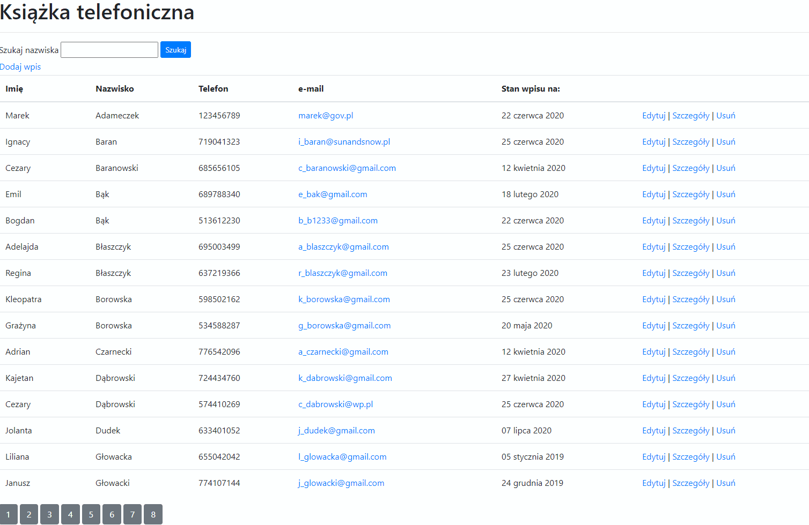

# Książka telefoniczna

Aplikacja *Książka telefoniczna* pomaga zarządzać podstawowymi danymi kontaktowymi. Apka zapisuje datę utworzenia oraz modyfikacji wpisu, aby umożliwić określenie, czy dane są aktualne. Dane nie mieszczące się na jednym ekranie są dzielone na strony. Apka udostępnia wyszukiwanie wpisów. W oknie wyszukiwania można używać wygodnej gwiazdki `*` (zastępuje dowolny ciąg znaków). Dane są zapisane w niezawodnej bazie SQL.

## Geneza

Aplikacja powstała jako jeden z projektów wykonywanych za zakończenie modułu w szkole programistycznej. Dla mnie to też powtórka i ćwiczenia w ASP .NET Core

## Co jest w środku

- CRUD
- partial views
- wyszukiwanie
- podłączony prosty bootstrap
- paginacja własnego pomysłu
- walidacja wprowadzanych danych po stronie serwera i od frontu

### Technologia/języki

- ASP .NET Core aplikacja webowa
- LinQ
- MSSQL Express
- HTML
- CSS

## Uruchomienie demo

Aplikacja wymaga serwera SQL i środowiska pozwalającego skompilować kod. Źrodła powstały w Visual Studio (.NET Core 3.1). Aby uruchomić aplikację, wykonaj kroki:

- Sklonuj projekt na komputer lokalny
- Utwórz bazę danych
  - Otwórz dołączony do projektu plik DbSchema.sql w edytorze Management Studio i wykonaj skrypt. Zostanie utworzona baza z przykładowymi danymi. Czasem skrypt przy pierwszym uruchomieniu daje komunikat o rollbacku. Dla pewności można skrypt uruchomić ponownie
  - Alternatywnie załączam także plik `Phonebook.bak` wykonany w wersji SSMS 18.4
- Skompiluj i uruchom projekt
